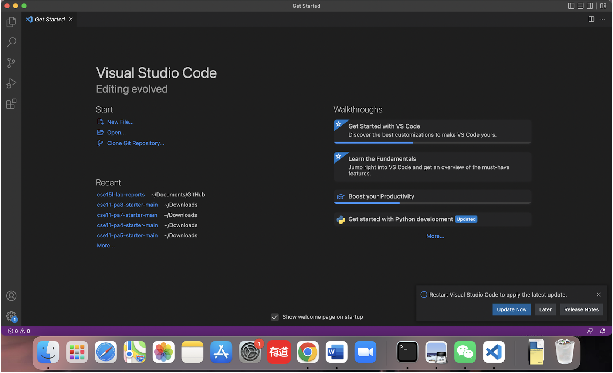
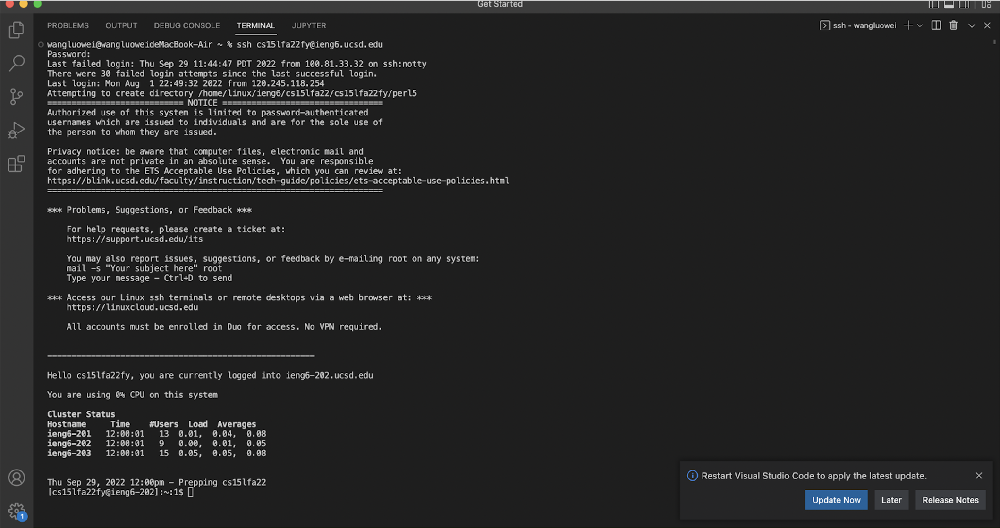
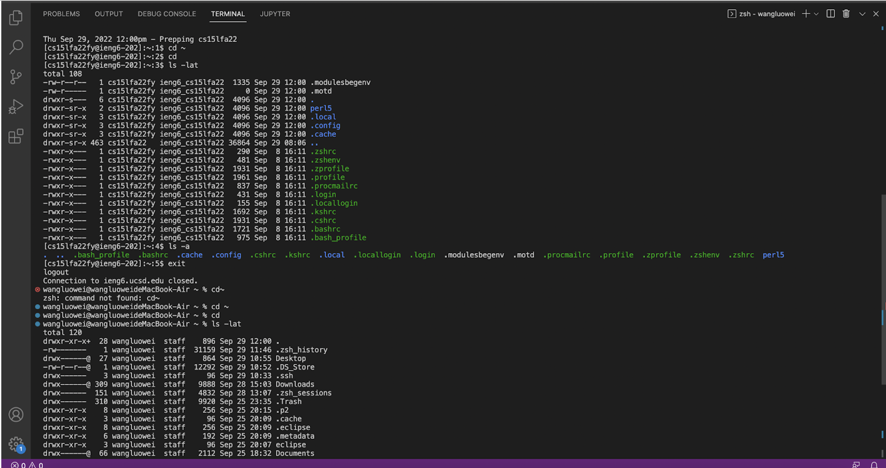
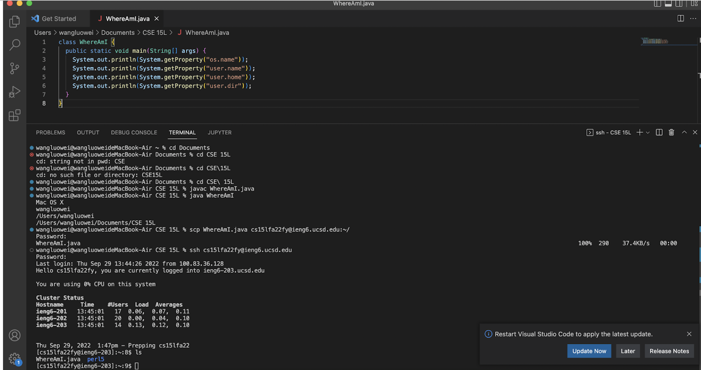
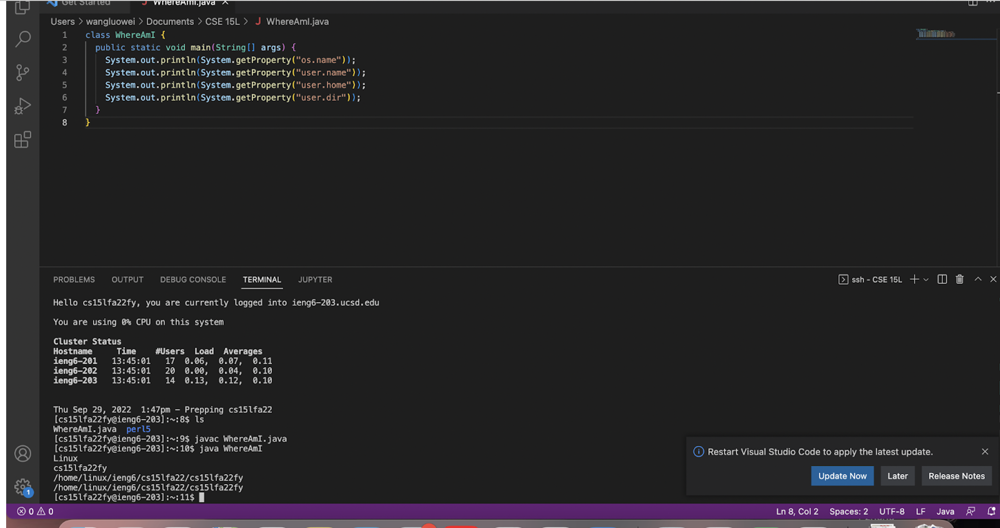
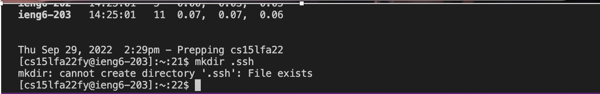
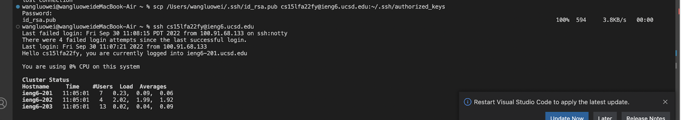
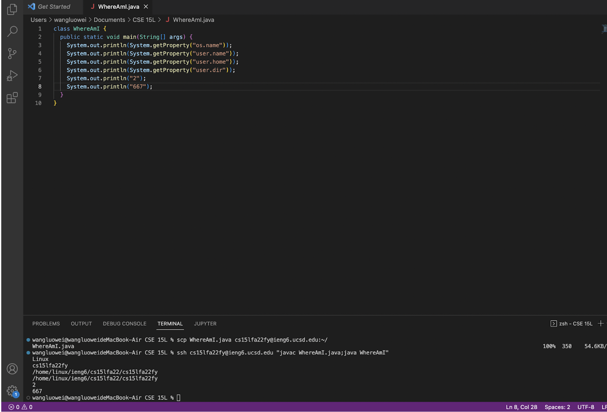

# Lab1 tutorial
* Installing VScode 
Because I have already downloaded VS code when I took CSE 8A, I didn't follow the step from the lab instruction.Link for download VS code:[Link](https://code.visualstudio.com/) 

* Remotely Connecting 
Firstly, change your password by going to [Link](https://sdacs.ucsd.edu/~icc/index.php) 
Wait the system to update your new password.  
type ssh cs15lfa22zz@ieng6.ucsd.edu in your terminal to connect to the remote server. zz should be replaced by your unique course account. 

* Trying Some Commands 
Try different commands both on the client and server. Observe the difference 
For example, you can try $cd, which means change directory. "ls" will print out the content of the directory you are in. 
Type "exit" to logout from the server. 

* Moving Files with scp 
Create a new file and try to use it by use command "javac" and "java". 
Then, copy the file to server by using the command "scp". Run this command with your username:scp WhereAmI.java cs15lfa22zz@ieng6.ucsd.edu:~/ Remember, do this in the directory you create the file. 

* Setting an SSH Key 
Type in command $ssh-keygen in your terminal, then press enter by three times: 
Enter file in which to save the key (/Users/joe/.ssh/id_rsa): /Users/joe/.ssh/id_rsa  
Enter passphrase (empty for no passphrase):  
Enter same passphrase again:  
Login to remote  
Type "mkdir .ssh".(If your .ssh already exists as mine, skip this step.）  
Logout  
Type "scp /Users/joe/.ssh/id_rsa.pub cs15lfa22@ieng6.ucsd.edu:~/.ssh/authorized_keys". Then, you can login and run scp without entering your password.

* Optimizing Remote Running 
To save time, you can type $ ssh cs15lfa22zz@ieng6.ucsd.edu "xx" where xx is the command you want to enter. In this way, you directly run the command onserver and then exit. We can run two commands at the same time by using semicolon to connect them. 

