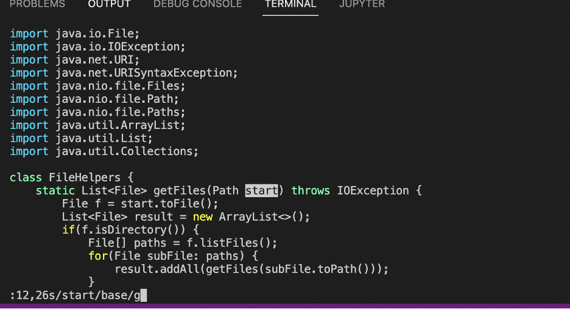
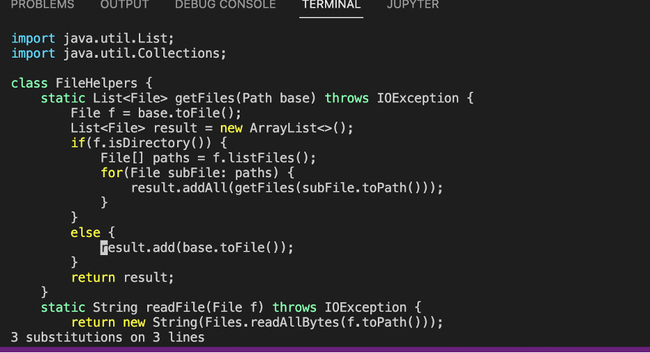
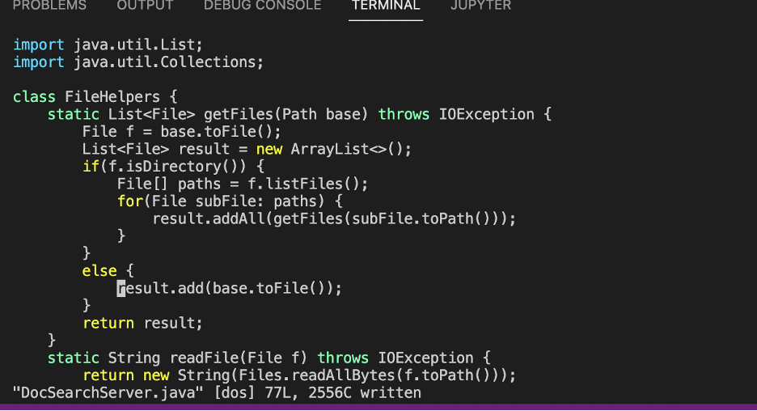

#Part1
:12,26s/start/base/g   This command can substitue "start" by "base" between line 12 and 26. 

<Enter>   After we press enter, we can see 3 substitutions happen on these 3 lines. 

:w<Enter>   The change is saved.  

I try to change the TestDocSearch.java of the repository week6-skill-demo1 that I have stored in remote server. Change “There are 10 total files to search” to “There are 1391 total files to search”. 
I use 2 minutes when I first edit it on my local computer and then scp it to remote and then run bash test.sh. I don’t encounter any difficulty. 
I use 2 minutes and 10 seconds when I log in to remote and make edit by using vim and then run bash test.sh. I don’t encounter any difficulty. 
I prefer to use the first way such that I edit it locally and then scp it to remote because it is easier for me to read and edit code on Visual Studio code. 
But, if my local computer doesn’t have the file that I want to edit, then I will chose the second way such that directly editing the file on remote using vim. Because if I choose the first way, I will firstly need to clone or create the file on my local computer and then edit it. 
