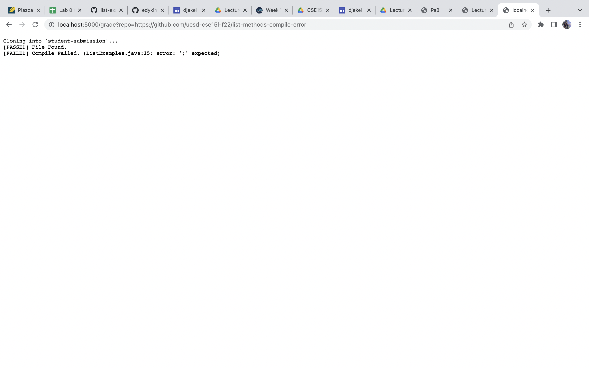
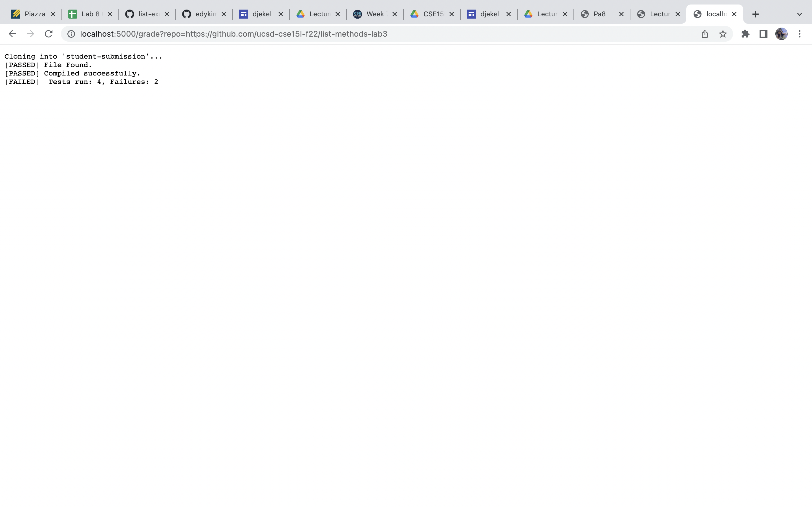

# Labreport5
```
# Create your grading script here
# remove student submission folder
rm -rf student-submission

# git clone the repo provided
git clone $1 student-submission

# check if file exists
if [ -f ./student-submission/ListExamples.java ]
then
    echo "[PASSED] File Found."
else
    echo "[FAILED] File Not Found"
    exit 1
fi
cp ./TestListExamples.java ./student-submission
cp -r ./lib ./student-submission

#go to dir
cd ./student-submission

CP=".:../lib/hamcrest-core-1.3.jar:../lib/junit-4.13.2.jar"
javac -cp $CP *.java 2> compile_error.txt

if [[ $? -eq 0 ]]
then
  echo "[PASSED] Compiled successfully."
else
  MSG=`cat compile_error.txt | head -1`
  echo "[FAILED] Compile Failed. ($MSG)"
  exit 1
fi

rm -rf test_result.txt
java -cp $CP org.junit.runner.JUnitCore TestListExamples > test_result.txt

JunitExitCode=$?

if [[ $JunitExitCode -eq 0 ]]
then
  a=`cat test_result.txt | grep "OK"`
  echo "[PASSED] " $a
else
  b=`cat test_result.txt | grep "Tests run:"`
  echo "[FAILED] " $b
  exit 1
fi
```



Trace script with the example of the first screenshot:
First, we remove student submission folder and git clone the repository. If cloned successfully, the exit code is 0 and the result output should go in to standard output. If clone fail, the exit code is nonzero and the error message goes in to standard error. Then, we go to the if condition that check whether ./student-submission/ListExamples.java file exists. Since it exists, "[PASSED] File Found." is shown. If it does not exist, we will show  "[FAILED] File Not Found", which is not true so we don't run it. Then, we copy the needed files for testing and go to the student-submission directory. Then, run the javac command to run junit test and redirect error into compile_error.txt. If the exit status of the last executed command is 0, this means that the file successfully compile. If not, then the file fails to compile and we will show the first line in compile_error.txt. The exit code will be 1. In this example, the file successfully compiles. Then, we remove test_result.txt and redirect the java junit output into test_result.txt.If the exit status of the last executed command is 0, this means that all tests passed and we show "[PASSED] " and the line that has the keyword "OK" using grep. If not, some tests fail and we showed [Failed] with the line that has the keyword "Tests run:". The exit code will be 1 In this example, all tests passed so we won't run the else part of the if statement.
